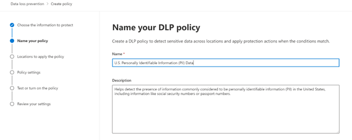
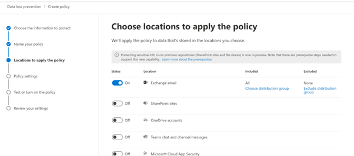
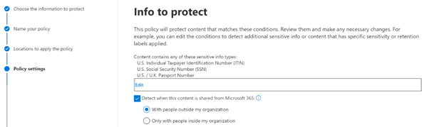
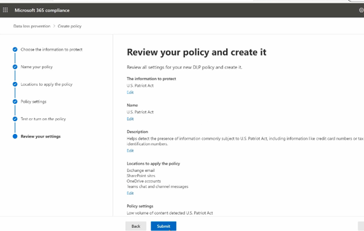

# Data-Loss-Prevention-DLP-
Create a DLP policy for PII only for Exchange. Set encrypt content to enable.

<h2>Description</h2>
Project consists of a creating a Data Loss Prevention policy as a part of Compliance standards. Microsoft Purview Data Loss Prevention (DLP) helps you prevent the unintentional or accidental sharing of sensitive information. DLP examines email messages and files for sensitive information, like a credit card number,PII number. Using DLP you can detect sensitive information, and take action such as:
   i. Log the event for auditing purposes
   ii. Display a warning to the end user who is sending the email or sharing the file
   iii. Actively block the email or file sharing from taking place

<br />


<h2>Environments Used </h2>

- <b>Microsoft Purview Compliance portal</b> 

<h2>Prerequisites</h2>

-<b> DLP policy for cloud apps can be created or modified by anyone assigned the following roles:
 - Power Platform Administrator
 - Security Administrator
 - Global Administrator
 </b>
- <b> Licenses:  Office 365 E3 or Microsoft 365 E3/E5 license</b>

<h2>Program walk-through:</h2>

<h3>Steps: </h3>

1.  Microsoft Purview portal --> Data loss prevention --> create policy
2.	‘Privacy’ category -> select template ‘US: PII’
3.	Give name and description and choose location ‘Exchange’ only
4.	Next -> Restrict access in Ms 365 locations
5.	Test policy 
6.	Review & create
	


<h3>Screenshots:</h3>

<p align="center">
Create policy and choose info to protect: <br/>

<br />
<br />
Give Name: <br/>

<br />
<br />
Choose Location: <br/>

<br />
<br />
Choose Info to protect: <br/>

<br />
<br />
Restrict Access: <br/>

<br />
<br />
Review & Create: <br/>

<br />
<br />


</p>

<!--
 ```diff
- text in red
+ text in green
! text in orange
# text in gray
@@ text in purple (and bold)@@
```
--!>
